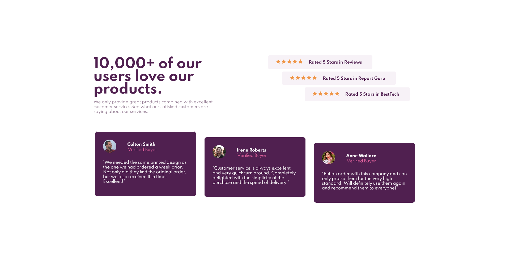

# Frontend Mentor - Social proof section solution

This is a solution to the [Social proof section challenge on Frontend Mentor](https://www.frontendmentor.io/challenges/social-proof-section-6e0qTv_bA). Frontend Mentor challenges help you improve your coding skills by building realistic projects. 

## Table of contents

- [Frontend Mentor - Social proof section solution](#frontend-mentor---social-proof-section-solution)
  - [Table of contents](#table-of-contents)
  - [Overview](#overview)
    - [The challenge](#the-challenge)
    - [Screenshot](#screenshot)
    - [Links](#links)
  - [My process](#my-process)
    - [Built with](#built-with)
    - [What I learned](#what-i-learned)
    - [Continued development](#continued-development)
    - [Useful resources](#useful-resources)
  - [Author](#author)

**Note: Delete this note and update the table of contents based on what sections you keep.**

## Overview

### The challenge

Users should be able to:

- View the optimal layout for the section depending on their device's screen size

### Screenshot

### Links

- Solution URL: [Github](https://github.com/L1m1tz/social-proof-section)
- Live Site URL: [Live site](https://l1m1tz.github.io/social-proof-section/)
  

## My process

### Built with

- Semantic HTML5 markup
- CSS custom properties
- Flexbox
- CSS Grid
- Web-first workflow

### What I learned

In this Challabge i solidified my flexbox and grid. i found that if i place each section of code in a solid border i'm able to align the code within their respective element without worrying about overflow that much.

### Continued development

In this challange i struggled with aligning  individual items within a grid column though i was able to find a way, this area needs further development. 
second isssue i had was to use the svg as backgrounds and i continue to struggle with that.
Futher research will be done on svgs and background images.

### Useful resources

- [FLEXBOX FROGGY](https://flexboxfroggy.com/) - Used thsi amazing website to relearn flexbox multiple times.

- [Grid Layout Box Alignment ](https://developer.mozilla.org/en-US/docs/Web/CSS/CSS_Grid_Layout/Box_Alignment_in_CSS_Grid_Layout) - Had to reread this page to reunderstand flexbox

## Author

- Website - [Andrew](http://siteforge.test/)
- Frontend Mentor - [@yL1m1tz](https://www.frontendmentor.io/profile/L1m1tz)
- Github - [@Andrew](https://github.com/L1m1tz)

